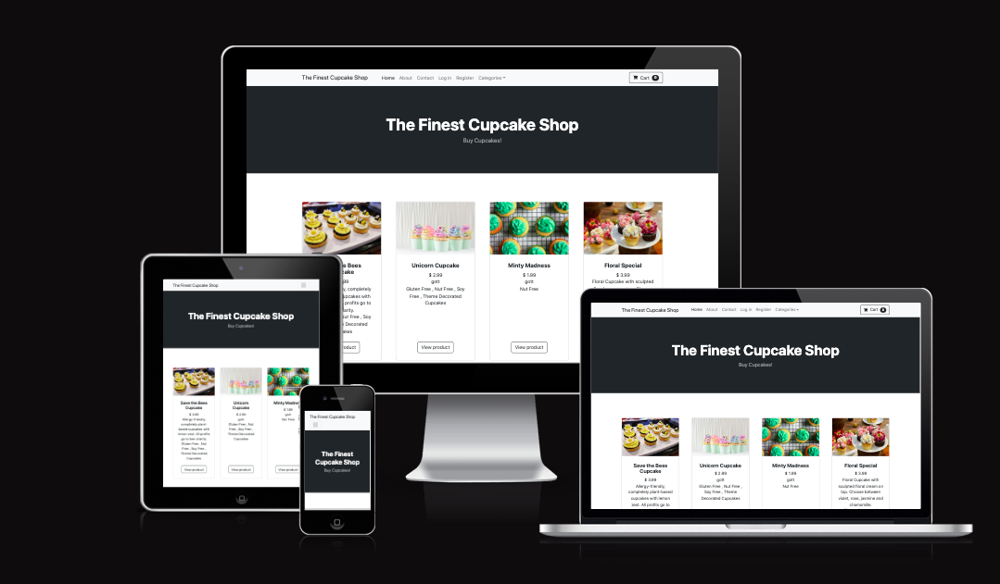
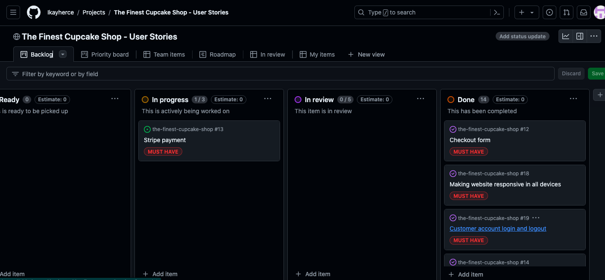
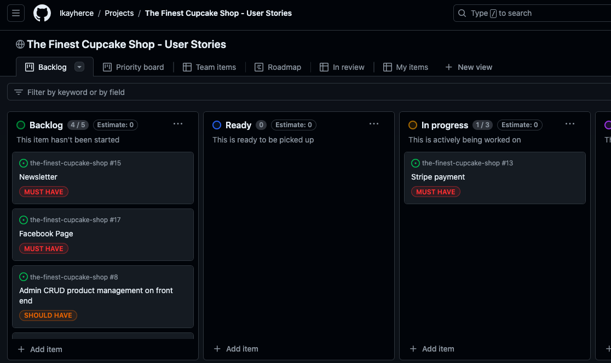

# The Finest Cupcake Shop

Deployed link: https://the-finest-cupcake-shop-bc4f44f161e9.herokuapp.com/

# Table of Contents

- [The Finest Cupcake Shop](#the-finest-cupcake-shop)
- [UX](#ux)
    - [Purpose](#purpose)
    - [User Stories](#user-stories)
    - [Wireframes](#wireframes)
- [Home Page](#home-page)
- [Shop App](#shop-app)
- [Cart App](#cart-app)
- [Payment App](#payment-app)
- [Agile Methodology](#agile-methodology)
- [Existing Features](#existing-features)
- [Features Left to Implement](#features-left-to-implement)
- [Web Marketing](#web-marketing)
- [Technologies Used](#technologies-used)

### UX
#### Purpose
The purpose of The Finest Cupcake Shop is for a small cupcake business to reach their audience and sell their products. The Finest Cupcake Shop offers specialises in plant-based products and allergy friendly options.
#### User Stories
Link to my User Stories in spreadsheet format https://docs.google.com/spreadsheets/d/1pGTRyGdKJuW5GuSuWoNzlggfeXokuzwzf6P6scxlwEY/edit#gid=0 

### Agile Methodology
Link to my Canban board on github: https://github.com/users/Ikayherce/projects/5/views/1 

### Existing Features
Navbar and Footer
Shop
Cart
Session 

### Features left to implement
Unfortunately due to time shortage some important features are left to implement or add to this project:
- Stripe payment implementation is not completed
- Robot.txt file is not included
- Subscription e-mail is not added
- Facebook mock-up page is not added

Other non-essential features that I wanted to add and didn't have time to are:
- Front End Admin Dashboard
- Delivery cost in order

### Web Marketing
- Subscription
Left to implement
- Facebook Page
Not added

### Technologies Used
Languages Used: 
- Python
- CSS
- HTML
- Javascript 

Technologies and Programs Used:
- django
- jquery
- bootstrap

### Tests
#### Code Validation: 
- HTML validation:
Not performed
- CSS validation
Not performed
- JavaScript validation
Not performed
- Python validator
Not performed
- Lighthouse
Not performed
- Manual tests
Not performed

### Project Bugs and Solutions:
#### Creating new branches
For this project I have created branches to test implementing solutions to different issues that have come up. The most important example is the change in my Product Model to add multiple categories (initially it was possible to just assign one category to each product). 

### Deployment 
Deployment to heroku
Forking the GitHub Repository
Getting Stripe keys
Setting AWS bucket

### Resources, credits and acknowledgements. 
For the code, I followed the following tutorials: 

- Code Institute's Boutique Ado walkthrough tutorial
- https://www.youtube.com/watch?v=_ELCMngbM0E&list=PL-51WBLyFTg0omnamUjL1TCVov7yDTRng
- https://www.youtube.com/watch?v=5n8FKv19os0&list=PL_KegS2ON4s53FNSqgXFdictTzUbGjoO-
- https://www.youtube.com/watch?v=u6R4vBa7ZK4&list=PLCC34OHNcOtpRfBYk-8y0GMO4i1p1zn50
- https://www.youtube.com/watch?v=UqSJCVePEWU&list=PLOLrQ9Pn6caxY4Q1U9RjO1bulQp5NDYS_

For the readme I got inspiration from these projects: 
https://github.com/JoGorska/bonsai-shop
https://github.com/ValeP314/pp5-tangled-treasures-v2

User stories template inspired in https://www.smartsheet.com/user-story-templates

